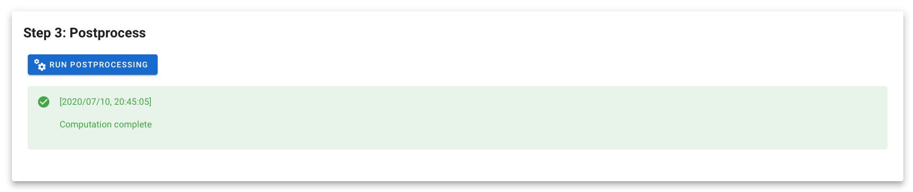

# 3. Postprocess the alerts

> :warning: Before launching the process, make sure that your instance is powerfull enough to run the process. `m4` is the minimum for country-size computation.

by clicking on `run postprocessing`, you will launch a computation of the glad alerts on your SEPAL computer. The differents step are described here:

- retreive the tiles from your google drive to the sepal `~/glad_results` folder
- merge the tiles to produce a single raster (.tif) with `oft-merg`
- delete the downloaded tiles
- create patches of glad alerts in a tmp file with `oft-clump`
- delete the tmp file
- produce a distribution of the glad alert patches using `oft-hist`

> :warning: This action is performed in your sepal compute, you don't want to close the sepal module before it's finished.

 

---
[ go to  &rarr; 2. Use the results](./results.md)  

[return to &larr; Retreive the alerts](./retreive_alert.md)
