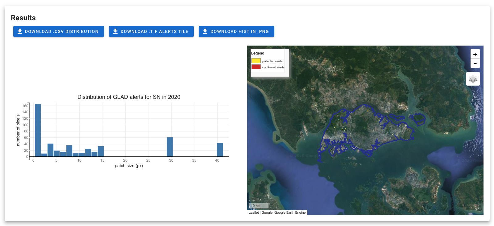
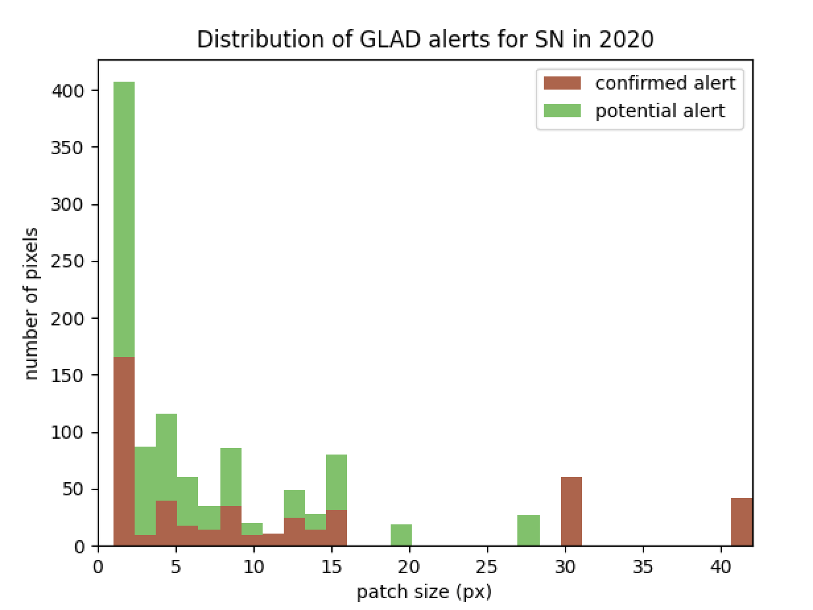

# 4. Use the results

The output are automatically generated after the postprocessing.
After finishing your analysis the module will give you several outputs that can be displayed in the `Result` tile.  
You can see here an example of the results obtained on Singapore for 2020

 

on the left you have the distribution of the confirmed Glad alerts (wheighted by there size). On the map you can observe the AOI boundaries in blue and the alerts in yellow (potential) and red (confirmed). This map is fully interactive.  
By clicking on the top buttons, you can obtain the files used to display the results : 
 - the raster of the glad alerts cliped on the AOI
 - the csv file of the alerts on the aoi, separated between confirmed and potential
 - the plot of the distribution of the alerts

 **SN_2020_hist.png**

  

**SN_2020_distrib.csv**
|patch size|1|2|3| ...|42|
|----------|-|-|-|----|--|
|confirmed alerts|109|28|3| ...|1|
|potential alerts|170|36|26|...|0|

 ---
 [return to &larr; Postprocess the alerts](./postprocess_alerts.md)
