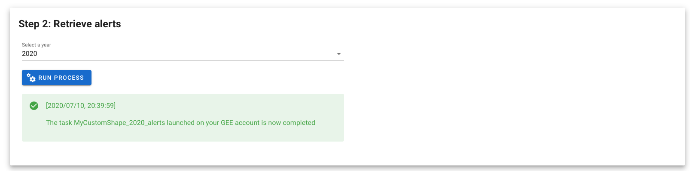

# 2. Retrieve the alerts

Select the GLAD alerts’ year you want to use in your analysis. The only available data at the moment (2020/07/10) are 2019 and 2020. 

By clicking on the “run process” `button`, you will launch the process on you GEE account. In the information banner, the module will give you insights on the progression of the process. 

> As the process is not launch on your sepal machine, you can close everything. In order for the module to reconnect to your process you'll need to use the same asset on the same year.

Once the process is completed you should obtain the following message:

 

---
[ go to  &rarr; 3. Postprocess the alerts](./postprocess_alerts.md)  

[return to &larr; select an AOI](./select_aoi.md)
